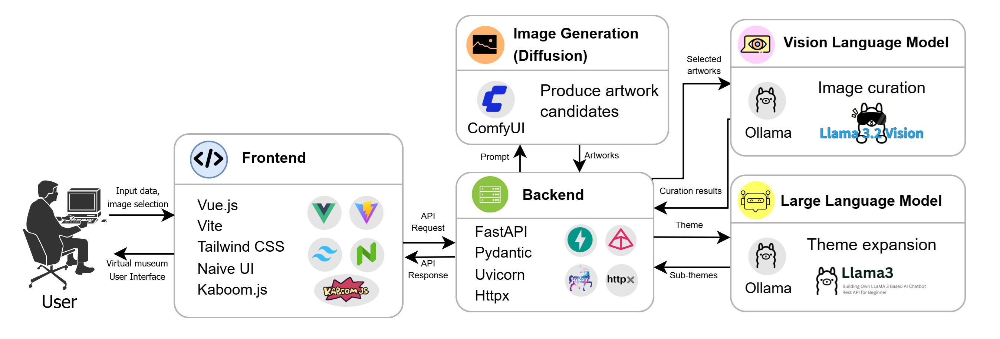

# 🏛️ AI Curatorial System

An intelligent, multi-model web application that acts as a virtual art curator. It generates deeply philosophical exhibition themes, creates unique artworks, and visually analyzes the generated pieces to produce museum-quality curatorial descriptions.



## 🎥 Demonstration

<video src="https://github.com/user-attachments/assets/3bf7a3de-5ae3-4153-838a-acce7f3a855a" controls="controls" width="100%"></video>

## ✨ Key Features

- **Macro-Curation (Text Reasoning):** Automatically expands a single user prompt into a cohesive, multi-section exhibition complete with poetic titles and philosophical introductions.
- **Generative Art Integration:** Dynamically interfaces with local diffusion models to create visual artifacts representing the exhibition themes.
- **Micro-Curation (Visual Analysis):** Uses a Vision-Language Model (VLM) to analyze the generated pixels and write unique, descriptive museum placards for every individual piece.
- **Multi-Model Routing Architecture:** Optimizes local GPU resources by routing text tasks to a lightweight text model and reserving a heavy multimodal model purely for visual processing.

## 🛠️ Tech Stack

**Front-end**

- **Vue.js:** Reactive JavaScript framework for building the dynamic user interface.
- **Vite:** Ultra-fast build tool and development server.
- **Tailwind CSS & Naive UI:** For clean, modern styling and UI components.

**Back-end**

- **FastAPI:** High-performance Python web framework for our API routing.
- **Uvicorn:** Lightning-fast ASGI web server.
- **Pydantic:** Strict data validation ensuring flawless JSON payloads.
- **httpx:** Asynchronous HTTP client for non-blocking AI server communication.

**AI & Machine Learning**

- **Ollama:** Local LLM server managing hot-swapping of models.
  - `llama3`: Text-based model for macro-curation.
  - `llama3.2-vision`: Multimodal model for image analysis and micro-curation.
- **ComfyUI:** Node-based local GUI/API for image generation.
  - `Stable Diffusion 1.5`: Foundational diffusion model for generating artworks (`v1-5-pruned-emaonly.safetensors`).

---

## 🚀 How to Run the Application

Because this system relies on entirely localized, private AI generation to protect data and avoid API costs, it requires running four separate services.

Open **four different terminal windows** and run the following commands:

### Terminal 1: Start the Image Generator (ComfyUI)

Navigate to your ComfyUI directory, activate its virtual environment, and start the server:

```bash
cd ../ComfyUI
source venv/bin/activate
python main.py
```

_Runs by default on `http://127.0.0.1:8188`_

### Terminal 2: Start the AI Brain (Ollama)

Start the background server and load the vision model into your GPU:

```bash
ollama run llama3.2-vision
```

_Runs by default on `http://127.0.0.1:11434`_

### Terminal 3: Start the Back-end (FastAPI)

Navigate to your `back-end` folder and launch the Uvicorn server:

```bash
cd back-end
uvicorn main:app --reload
```

_Runs by default on `http://127.0.0.1:8000`_

### Terminal 4: Start the Front-end (Vue.js + Vite)

Navigate to your `front-end` folder and start the Vite development server:

```bash
cd front-end
npm run dev
```

_Runs by default on `http://localhost:5173`_

---

## 🎨 Usage

1. Open your browser and navigate to the Front-end URL (`http://localhost:5173`).
2. Enter a theme (e.g., "Emotional Landscapes").
3. Watch as the AI generates sub-themes and curatorial descriptions.
4. Select 2-3 artworks per section.
5. Proceed to the Final Curation, where the Vision model will visually analyze your selections and write the museum placards.
6. Enjoy your virtual museum exhibition!

---

## 🔗 Acknowledgments & References

This project implementation is based on and made possible by these incredible tools and resources:

- [Vue.js](https://vuejs.org/)
- [FastAPI](https://fastapi.tiangolo.com/)
- [Ollama](https://ollama.com/)
- [ComfyUI](https://comfy.org/)
- [2D Portfolio Kaboom (JSLegendDev)](https://github.com/JSLegendDev/2d-portfolio-kaboom)
